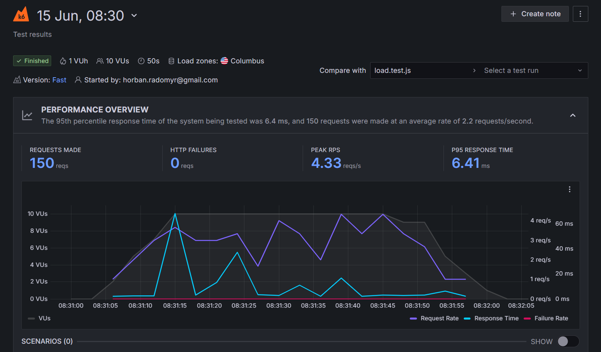
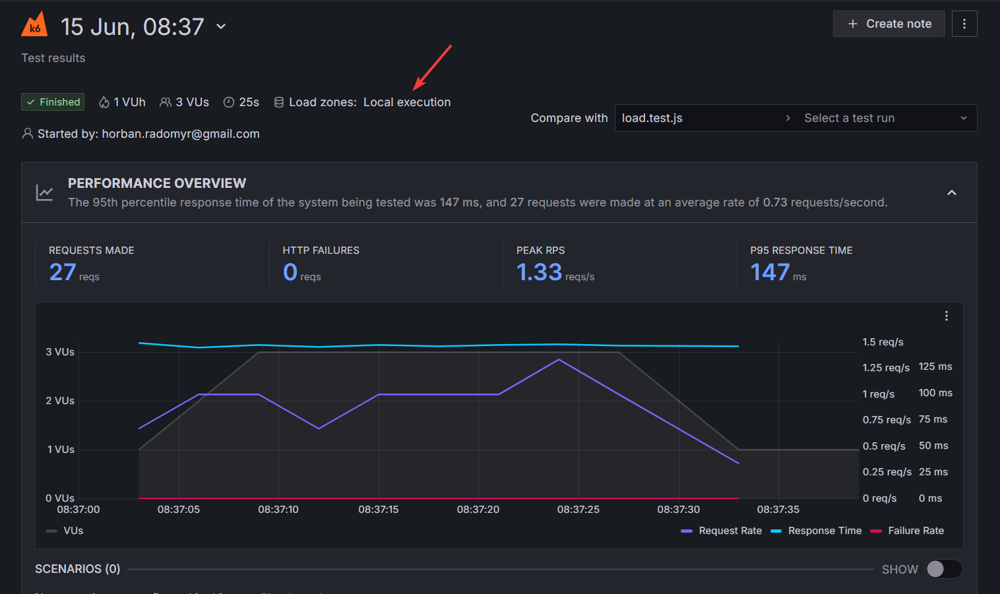

# 🚀 k6 Performance Testing with Grafana Cloud

This project uses [k6](https://k6.io/) for performance and load testing, with metrics sent to **Grafana Cloud** for powerful visualizations and dashboards. It is designed for local development and CI environments.

## ⚙️ Setup

### 1. Install k6

Install k6 on your local machine:

```bash
# macOS (Homebrew)
brew install k6

# Ubuntu
sudo apt install k6

# Windows (winget)
winget install k6 --source winget

```

## ⚙️ Grafana Cloud Setup

- create a Grafana Cloud account
- generate and copy Personal API token
- run `k6 cloud login --token <YOUR_API_TOKEN>`

## 🧪 Running Tests

### Local Run

```bash
k6 run tests/basic-concepts/groups.test.js
```

### Local Run with verbose logs

```bash
k6 run tests/basic-concepts/groups.test.js --summary-mode=full
```

### Export test results in `json` format

```bash
k6 run tests/basic-concepts/groups.test.js --summary-export=src/test-results/results.json
```

or more verbose results

```bash
k6 run tests/basic-concepts/groups.test.js --out json=src/test-results/full_results.json
```

### Cloud Run

```bash
k6 cloud tests/example-test.js
```



### Local Run and Export results to Grafana Cloud

```bash
k6 run tests/basic-concepts/groups.test.js -o cloud
```


